<div align="center">

```
 ░▒▓█  N I L T O N  C A R L O S  D A  C O S T A  █▓▒░
```


```
        ██████╗  █████╗ ██╗    ██╗ ██████╗
        ██╔══██╗██╔══██╗██║    ██║██╔════╝
        ██║  ██║███████║██║ █╗ ██║██║  ███╗
        ██║  ██║██╔══██║██║███╗██║██║   ██║
        ██████╔╝██║  ██║╚███╔███╔╝╚██████╔╝
        ╚═════╝ ╚═╝  ╚═╝ ╚══╝╚══╝  ╚═════╝

           BUILT IN LUANDA. BUILT FOR AFRICA.
```

<br/>

[](https://git.io/typing-svg)

<br/>

[](https://www.linkedin.com/in/nilton-costa-a04916277)
[](https://github.com/NiltonCarlosdawg)
[](mailto:niltoncost186@gmail.com)
[](https://niltoncarlosdawg.github.io/cv)

<br/>


</div>

---


### `> whoami`

```yaml
nome:       Nilton Carlos Domingas Da Costa
alias:      @NiltonCarlosdawg
cargo:      Co-Founder & COO @ Verano Labs
base:       Luanda, Angola 🇦🇴
status:     Disponível para projectos
foco:       Produtos digitais para o mercado africano
filosofia:  "Tecnologia feita em África, para África."
```

<br clear="right"/>

---

## `◈` SOBRE MIM

Sou **Full Stack Developer** e **COO** na [**Verano Labs**](https://github.com/NiltonCarlosdawg) — startup tecnológica fundada em Luanda em 2026.

Construo ecossistemas digitais do banco de dados à interface, com atenção obsessiva a **clean code**, **escalabilidade** e **experiência do utilizador**. Cada produto que lanço tem contexto: o kwanza, o kilamba, a realidade do dia-a-dia angolano.

> *A melhor solução para África não vem importada. Vem daqui.*

---

## `◈` STACK

<div align="center">

**Frontend**


**Backend**


**Base de Dados & Infra**


**IA & Especialidades**


</div>

---

## `◈` PROJECTOS EM DESTAQUE

<div align="center">

| ⬡ | Projecto | Descrição | Stack |
|:---:|---|---|---|
| 🟡 | **[KAMBA Finance](https://github.com/NiltonCarlosdawg/kamba)** | Assistente financeiro com IA para gestão em Kwanzas — orçamentos, transacções, análise inteligente de despesas | React · TypeScript · Node.js · Anthropic API |
| 🔵 | **[PedeJá](https://github.com/NiltonCarlosdawg/pedeja)** | Plataforma de delivery para Luanda com 4 roles: cliente, restaurante, estafeta e admin | React · TypeScript · PostgreSQL |
| 🟢 | **[QRinvite](https://github.com/NiltonCarlosdawg/qrinvite)** | Sistema de convites para eventos com validação por QR Code em tempo real | TypeScript |
| 🔴 | **[UNIPASS](https://github.com/NiltonCarlosdawg/unipass)** | Sistema de acesso e gestão universitária | — |
| ⚫ | **[kambass](https://github.com/NiltonCarlosdawg/kambass)** | Backend robusto da plataforma KAMBA | JavaScript · Node.js |

</div>

---

## `◈` O QUE ESTOU A CONSTRUIR AGORA

```
 VERANO LABS — Luanda, Angola · Jan 2026 → ...
 ┌─────────────────────────────────────────────────────┐
 │                                                     │
 │  ◆ KAMBA Finance    → full-stack em dev activo      │
 │  ◆ KINO Delivery    → React Native · Kilamba/KK5000 │
 │  ◆ MilVendas        → e-commerce + ALS recommender  │
 │  ◆ CalungaSoft      → multi-tenant chat + WhatsApp  │
 │                                                     │
 │  🏆  ANGOTIC 2026 — Expositores Confirmados         │
 │                                                     │
 └─────────────────────────────────────────────────────┘
```

---

## `◈` ESTATÍSTICAS

<div align="center">


<br/>

[](https://git.io/streak-stats)

</div>

---

## `◈` FORMAÇÃO

```
 🎓  Técnico de Informática — TCC
     IMTELC · Instituto Médio de Tecnologias, Línguas, Cultura e Ciência
     Luanda, Angola · 2023 — 2026
     Projecto Final: KAMBA Finance — AI-powered financial assistant
```

---

<div align="center">

```
━━━━━━━━━━━━━━━━━━━━━━━━━━━━━━━━━━━━━━━━━━━━━━━━━━━━━
  "Try beat my dawg on top commits."
━━━━━━━━━━━━━━━━━━━━━━━━━━━━━━━━━━━━━━━━━━━━━━━━━━━━━
```

**📍 Luanda, Angola &nbsp;·&nbsp; 🏢 Verano Labs &nbsp;·&nbsp; 🇦🇴 Built for Africa**

*Zero imports. Zero compromise. 100% Angola.*

</div>
